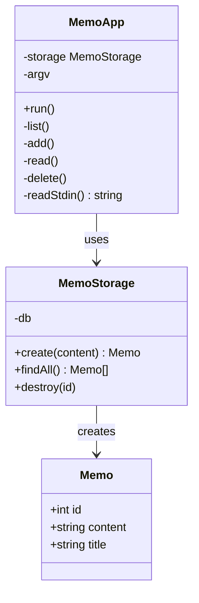

```mermaid
classDiagram
  class Memo {
    +int id
    +string content
    +string title
  }

  class MemoStorage {
    -db
    +create(content) Memo
    +findAll() Memo[]
    +destroy(id)
  }

  class MemoApp {
    -storage MemoStorage
    -argv
    +run()
    -list()
    -add()
    -read()
    -delete()
    -readStdin() string
  }

  MemoApp --> MemoStorage : uses
  MemoStorage --> Memo : creates
```
